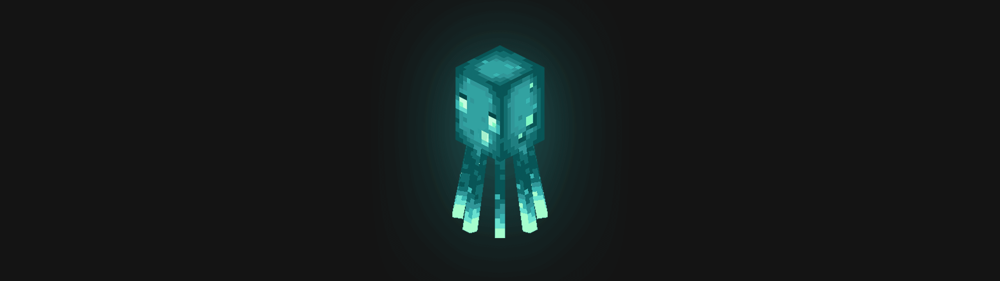

# oioi, meu nome é Italan.

**UPE** ● **dotLab** ● **Lea**  

📌 Desenvolvedor back-end  
📌 Experiência com visualização de dados  
📌 Interesse em Gerenciamento de Processo de Negócio

 
  
  
  
  
  
  
  
          
  <!--
  
  
  
  
  
  -->

---
### [Glow Squid 🦑✨](https://minecraft.fandom.com/wiki/Glow_Squid)

<!--
**italanleal/italanleal** is a ✨ _special_ ✨ repository because its `README.md` (this file) appears on your GitHub profile.

Here are some ideas to get you started:

- 🔭 I’m currently working on ...
- 🌱 I’m currently learning ...
- 👯 I’m looking to collaborate on ...
- 🤔 I’m looking for help with ...
- 💬 Ask me about ...
- 📫 How to reach me: ...
- 😄 Pronouns: ...
- ⚡ Fun fact: ...
-->
